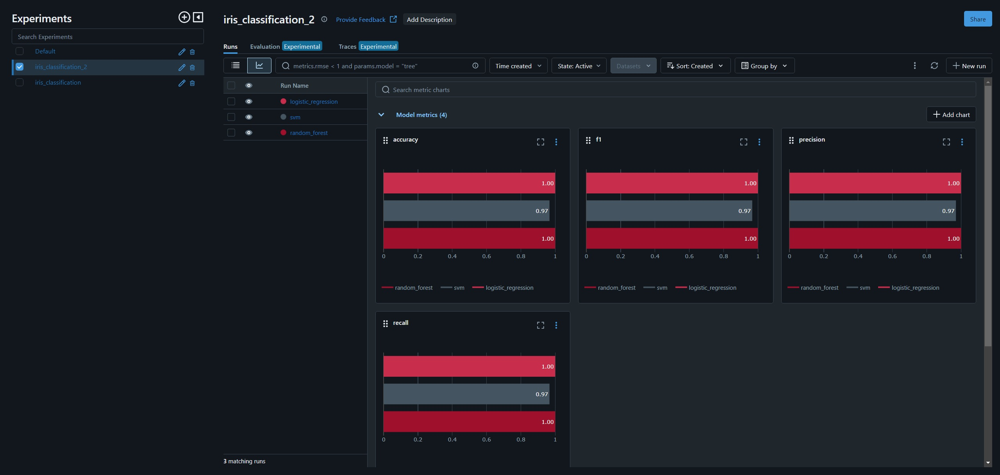

# **Итоговое задание по ML Ops**
## Цель:

Познакомимся с основами управления данными с помощью DVC, управления экспериментами с использованием MLflow и автоматизации с ClearML. 

## Этапы

**Этап 1:** Управление данными с DVC — включает добавление данных в управление с помощью DVC, настройку удаленного хранилища и интеграцию с Git Hub Action для автоматического запуска пайплайна.

**Этап 2:** Управление экспериментами с MLflow — управление ML-экспериментами, регистрация метрик и моделей.

**Этап 3:**: Автоматизация экспериментов с ClearML — настройка ClearML для отслеживания задач, логирования метрик и автоматизации экспериментов

# Отчет по экспериментам MLflow

## Описание задачи

В данном отчете представлены результаты экспериментов по обучению модели логистической регрессии на наборе данных Iris. Целью экспериментов было сравнение производительности моделей с различными параметрами регуляризации (`C`) и алгоритмами оптимизации (`solver`).

## Данные

В качестве данных был использован набор данных Iris, загруженный и предобработанный с помощью файлов `download.py` и `preproc_data.py`.

## Эксперименты

Был проведен один эксперемент с использованием трёх моделей:

### Модель 1 RandomForestClassifier

*   **Параметры:**
    *   `n_estimators`: 20
    *   `max_depth`: 5
*   **Метрики:**
    *   `accuracy`: 1.0
    *   `f1`: 1.0
    *   `precision`: 1
    *   `Duration`: 1

### Модель 2 SVM

*   **Параметры:**
    *   `C`: 0.2
    *   `kernel`: `rbf`
*   **Метрики:**
    *   `accuracy`: 0.96666
    *   `f1`: 0.9667502
    *   `precision`: 0.97
    *   `Duration`: 0.97

### Модель 2 Логистическая регрессия

*   **Параметры:**
    *   `C`: 0.1
    *   `max_iter`: 100`
*   **Метрики:**
    *   `accuracy`: 1
    *   `f1`: 1
    *   `precision`: 1
    *   `Duration`: 1

## Сравнение моделей

По результатам проведенных экспериментов можно сделать следующие выводы:

Модели RandomForestClassifier и Логистическая регрессия  показал себя лучше с точки зрения точности , чем SVM. 

## Рекомендации

*   Провести дополнительные эксперименты с разными параметрами и данными, чтобы убедиться в стабильности результатов.
*   Включить в отчет метрику - `Duration, recall и precision.
*   Использовать графики из MLflow UI для более наглядного представления результатов.

## Зависимости:

* Python
* MLflow
* scikit-learn
* pandas